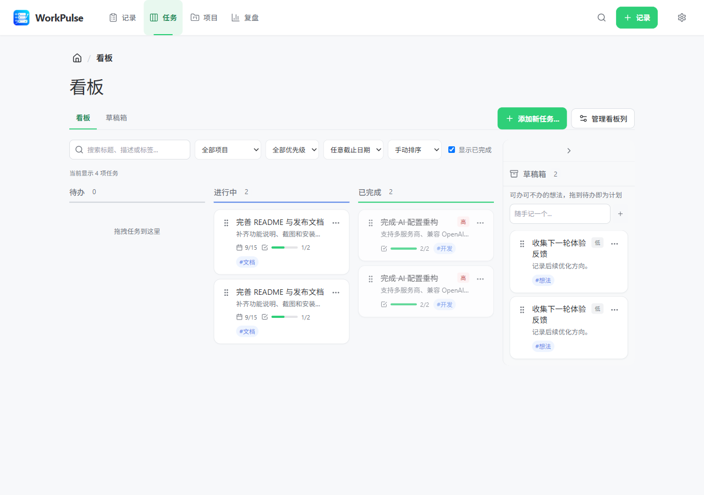
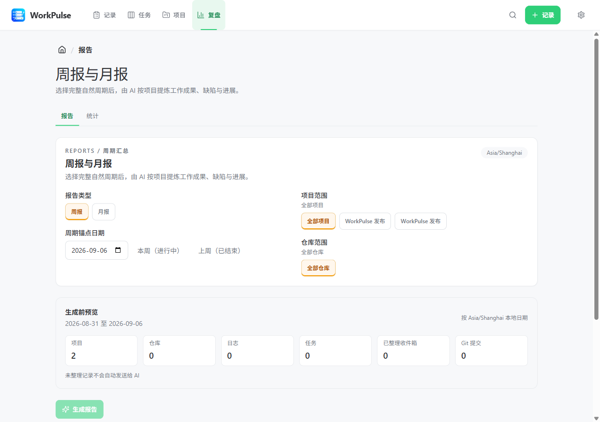
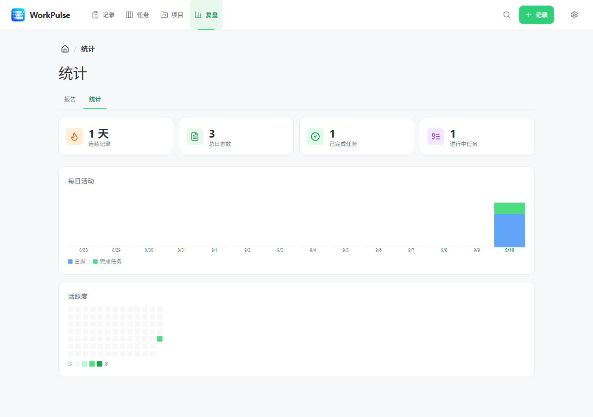

# 拾光 (WorkPulse)

一款轻量桌面应用，几秒钟记录你的每日工作——写下做了什么、用看板管理任务、用 AI 生成工作报告。

为每一个想轻松回顾"今天干了啥"的打工人而生。

## 截图

| 工作日志 | 看板 |
|---------|------|
|  |  |

| AI 报告 | 统计 |
|---------|------|
|  |  |


## 功能

**工作日志** — 输入你刚做了什么，按回车，完成。支持 `#标签` 自动分类、全文搜索、撤销删除，以及带分类信息的 CSV/Markdown 导出；也可以直接导入 Flomo HTML 笔记，保留原始时间、标签、Markdown 格式和图片附件。图片会复制到 WorkPulse 附件目录；音频、视频、缺失或不支持格式的附件不会复制，并在导入结果中提示。

**看板任务** — 在待办 → 进行中 → 已完成之间拖拽任务卡片。有草稿箱存放"以后再说"的想法，支持截止日期、搜索筛选、优先级排序和详情抽屉编辑。完成任务时自动生成一条工作日志。

**AI 报告** — 选择时间范围，一键生成结构化工作总结。报告会结合工作日志和任务上下文，支持 OpenAI/Anthropic 兼容服务，可预览、编辑、保存到历史、复制或导出。

**项目、收件箱与 Git 活动** — 零散想法可先记录到收件箱，再整理为日志或任务；任务可独立存在，也可选归属项目，日志支持项目、仓库和多个 `#标签` 归属。可扫描用户选择的本地 Git 仓库，只读取提交摘要，并按项目汇总到报告中。

**数据统计** — 14 天活动柱状图、GitHub 风格热力图、连续记录天数、任务完成统计。

**快速记录** — 可配置全局快捷键（默认 `Ctrl+Shift+L` 记日志、`Ctrl+Shift+T` 加任务）让你无需切换窗口即可记录。快速日志同样支持 `#标签` 解析，也可从菜单栏托盘图标操作。

**深色模式** — 跟随系统、浅色、深色三种主题，全界面覆盖。

**在线更新** — 应用会从 `Orzlk/WorkPulse` 检查 GitHub Release；发现新版本后自动下载，并可在设置中重启安装。

## 发布与在线更新

源码 Git 远端与应用在线更新地址相互独立。当前应用使用 `Orzlk/WorkPulse` 的 GitHub Release 作为更新源；即使将源码远端改为 Gitee，应用仍会访问 GitHub，不会自动切换到 Gitee。

如果需要完全使用 Gitee 发布更新，需要额外对接 Gitee Release API，或将 `latest.yml`、安装包和校验信息部署到可公开访问的 HTTPS 地址，并改用 `electron-updater` 的 Generic Provider。仅修改 Git 远端地址不足以完成切换。

## 技术栈

- **Electron** + **React** + **TypeScript**
- **Vite** (electron-vite) 快速构建
- **SQLite** (better-sqlite3) 本地数据存储
- **Zustand** 状态管理
- **@dnd-kit** 拖拽排序
- **Tailwind CSS** 样式

## 快速开始

```bash
# 安装依赖
npm install

# 开发模式运行
npm run dev

# 生产构建
npm run build

# 打包分发
npm run dist:mac    # macOS (DMG + ZIP, x64 + arm64)
npm run dist:win    # Windows (NSIS 安装包)
npm run dist:linux  # Linux (AppImage)
```

## 安装说明

### macOS

由于安装包未签名，macOS 在首次打开时会提示"已损坏"。把 `WorkPulse.app` 拖到 `/Applications` 之后，在终端执行一次以下命令以清除隔离属性：

```bash
xattr -cr /Applications/WorkPulse.app
```

然后正常打开应用即可。

## 快捷键

| 快捷键 | 功能 |
|--------|------|
| `⌘1` / `Ctrl+1` | 切换到工作日志 |
| `⌘2` / `Ctrl+2` | 切换到看板 |
| `⌘3` / `Ctrl+3` | 切换到项目 |
| `⌘4` / `Ctrl+4` | 切换到报告 |
| `⌘5` / `Ctrl+5` | 切换到收件箱 |
| `⌘,` / `Ctrl+,` | 设置 |
| `Ctrl+Shift+L` | 全局快速记录日志 |
| `Ctrl+Shift+T` | 全局快速添加任务 |

## 数据与安全

阶段一采用本地优先设计。数据库位于 Electron 系统 `userData` 目录的 `workpulse.db`，迁移前备份位于 `userData/backups`。当前数据库版本为 1，代表合并后的预发布数据库结构；旧开发版本数据库不会由此版本自动升级，使用前应先备份/导出、重新创建数据库，再重新导入数据。应用启动时以事务执行迁移并校验完整性。导入导出使用带版本的逻辑 JSON 数据包，而非直接覆盖 SQLite 文件：导入先预览，再按 `public_id` 合并；导入的仓库绑定默认不可用，需用户手动确认本地路径。

Git 扫描只会对用户选择的路径执行只读 `rev-parse` 与 `log` 命令，绝不执行 checkout、fetch、reset 等写操作。导出包不包含设置、API Key 或本地仓库路径。

AI 周报/月报只会接收所选时间范围内经授权的日志文本、任务必要字段、已确认且允许纳入报告的收件箱记录、Git 提交摘要、项目/仓库范围和标签名称。未整理草稿、API Key、设置和本地仓库路径不会发送给 AI 服务商。周报按自然周（周一至周日）生成，月报按自然月生成；二者使用选定时区展示，并以 UTC 左闭右开区间存储和查询。

阶段一不包含登录、云端同步、在线工作区或多人/团队协作。数据仅保留在当前设备；只有用户主动导出，或主动对已确认的报告范围发起 AI 生成时，数据才会离开本地。

## 许可证

本项目基于 [dobest1024 的 WorkPulse](https://github.com/dobest1024/WorkPulse) 进行改进。原作者的 MIT 版权声明已保留在 [LICENSE](./LICENSE) 中，本仓库的修改由 Orzlk 完成。
